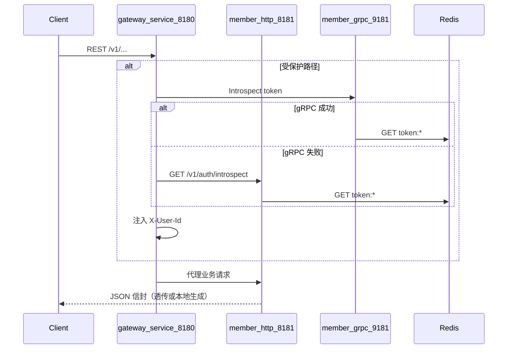

# API 规范索引

本文档描述 **go-template** 对外 API 的设计原则与专题入口。实现以 `gateway-service`（`:8180`）为唯一对外 HTTP 入口，`member-service`（`:8181` HTTP / `:9181` gRPC）承载业务。

## 读者

- 前端 / 客户端开发者
- 网关与业务服务后端开发者
- Cursor Agent（配合 `.cursor/rules/` 与 `.cursor/skills/api-change/`）

## 架构概览

## 服务边界

| 服务 | 端口 | 职责 |
|------|------|------|
| `gateway-service` | 8180 | CORS、鉴权、路由、反向代理；**不写业务逻辑** |
| `member-service` | 8181 / 9181 | 注册、登录、登出、资料、token introspect |

**对外约定**：浏览器与第三方客户端只访问 Gateway。直连 `member-service` 仅限开发调试或内网服务间调用。

## 专题文档

| 文档 | 内容 |
|------|------|
| [rest-conventions.md](rest-conventions.md) | 路径、方法、JSON 信封、请求头、分层 |
| [auth.md](auth.md) | Token 机制、鉴权流、接口示例 |
| [error-codes.md](error-codes.md) | 业务错误码编码规则与完整对照表 |
| [grpc.md](grpc.md) | 内部 gRPC 约定与生成步骤 |
| [websocket.md](websocket.md) | WebSocket 实时通道（规划中 + 占位实现） |

## 当前对外 HTTP 接口（经 Gateway）

| 方法 | 路径 | 鉴权 |
|------|------|------|
| GET | `/healthz` | 否 |
| GET | `/v1/public/config` | 否 |
| POST | `/v1/auth/register` | 否 |
| POST | `/v1/auth/login` | 否 |
| POST | `/v1/auth/logout` | 是 |
| GET / PUT | `/v1/member/users/profile` | 是 |
| GET | `/v1/ws` | 否（占位，返回 501 + `50101`） |

## 测试与工具

- Postman：`api/postman_collection.json`
- 冒烟：`./scripts/smoke-auth-flow.sh`
- 统一响应实现：`internal/platform/httpx/httpx.go`

## 文档维护原则

1. 新增或修改 handler 中的 `code` / `message` 时，**先更新** [error-codes.md](error-codes.md)。
2. 新增对外路径时，同步更新本表、Postman 与 [rest-conventions.md](rest-conventions.md) 中的路径映射说明。
3. 禁止在 `gateway-service` 的 transport 层实现业务规则；业务只放在 `member-service` 的 `app` / `repo`。
