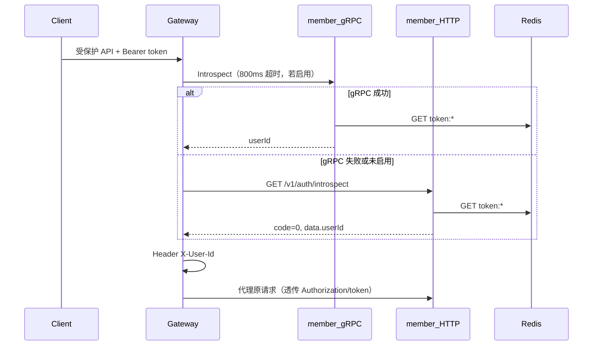

# 认证与授权

## 机制概述

本模板使用 **不透明 Access Token**（随机 hex 字符串），存储在 Redis：

- 键：`token:<token>` → 值：`userID`
- TTL：**12 小时**（`AccessTokenTTL`，见 `internal/member/app/service.go`）

**不是** JWT、**不是** API Key。网关与 member 通过 **introspect** 反查 userID。

登录响应中的 `refreshToken` 会生成并返回，但 **当前未写入 Redis、不参与校验**；客户端请勿依赖刷新流程，直至后续版本实现。

## Token 传递

优先级（gateway 与 member 一致）：

1. `Authorization: Bearer <token>`
2. 请求头 `token: <token>`
3. Query `?token=<token>`

## 鉴权流程



## 路径与鉴权表

### 网关 `RequiresAuth`

以下路径在 gateway 层 **必须先** 通过 token 校验：

| 路径 | 方法 |
|------|------|
| `/v1/auth/logout` | POST |
| `/v1/member/users/profile` | GET, PUT |

其余经 gateway 注册的路径（如 login、register、health、public config）**不**在网关鉴权，由 member 自行处理 token（如 logout 在 member 仍校验 token）。

### 内部接口（不应对外暴露）

| 路径 | 说明 |
|------|------|
| `GET /v1/auth/introspect` | 供 gateway gRPC/HTTP 回退使用 |

## 接口说明

基础 URL：`http://<gateway-host>:8180`

### 注册 `POST /v1/auth/register`

请求体：

```json
{
  "username": "demo_user",
  "password": "123456",
  "mobile": "13800138000",
  "email": "demo@example.com",
  "nickname": "Demo",
  "parentId": "",
  "inviteCode": "",
  "avatar": "",
  "remark": ""
}
```

成功：`code: 0`，`data` 为用户资料对象。

### 登录 `POST /v1/auth/login`

请求体（`username` 与 `mobile` 二选一）：

```json
{
  "username": "demo_user",
  "password": "123456"
}
```

成功 `data` 主要字段：

| 字段 | 说明 |
|------|------|
| `accessToken` / `token` | 访问令牌（相同值） |
| `refreshToken` | 仅返回，**未启用校验** |
| `expire` | 秒，43200（12h） |
| `id`, `username`, `mobile`, ... | 用户快照 |

### 登出 `POST /v1/auth/logout`

需鉴权。Header：`Authorization: Bearer <accessToken>`。

成功：`data.loggedOut: true`（兼兼容 `logged_out`）。

### 用户资料 `GET | PUT /v1/member/users/profile`

需鉴权。

- **GET**：返回当前用户资料。
- **PUT**：至少更新一个字段：`email`、`mobile`、`nickname`、`avatar`、`remark`。

网关鉴权后向 member 注入 `X-User-Id`；member 亦支持从 token 解析用户。

## 密码与安全备注

- 存储：密码以 **MD5 hex** 写入数据库（遗留兼容）。
- 校验：支持明文或 MD5 入参比对。
- 新系统应规划迁移到 bcrypt/argon2 等；**本规范文档不改动现有实现**。

## 测试

```bash
./scripts/smoke-auth-flow.sh
# 或指定网关
BASE_URL=http://127.0.0.1:8180 ./scripts/smoke-auth-flow.sh
```
