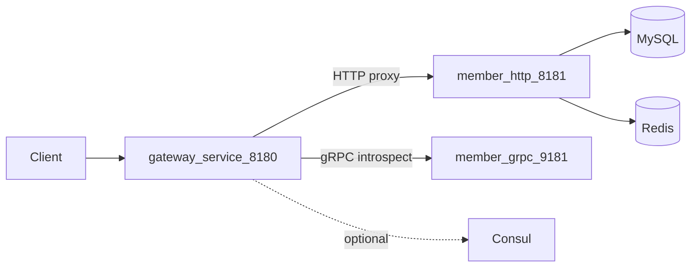

# 架构总览

go-template 是双服务微服务模版：**gateway-service** 对外，**member-service** 承载用户域业务。

## 拓扑

## 端口

| 服务 | HTTP | gRPC |
|------|------|------|
| gateway-service | 8180 | — |
| member-service | 8181 | 9181 |

## 依赖

| 组件 | 用途 | 必需 |
|------|------|------|
| MySQL | 用户表 | 是 |
| Redis | token 存储 | 是 |
| Consul | 服务发现 | 否 |

## 配置优先级

`系统环境变量` > `configs/.env` > `.env` > `configs/app.<env>.json` > 代码默认值

详见 [config.md](config.md)。

## 文档导航

| 文档 | 内容 |
|------|------|
| [services.md](services.md) | 服务职责与禁止事项 |
| [config.md](config.md) | 配置字段表 |
| [local-dev.md](local-dev.md) | 本机 / Compose 启动 |
| [add-service.md](add-service.md) | **新增第三个微服务 playbook** |

## 对外原则

- 浏览器与第三方 **只访问 gateway-service**
- member-service HTTP 仅 dev 调试或内网
- 网关 **不写业务逻辑**（鉴权、CORS、代理除外）
