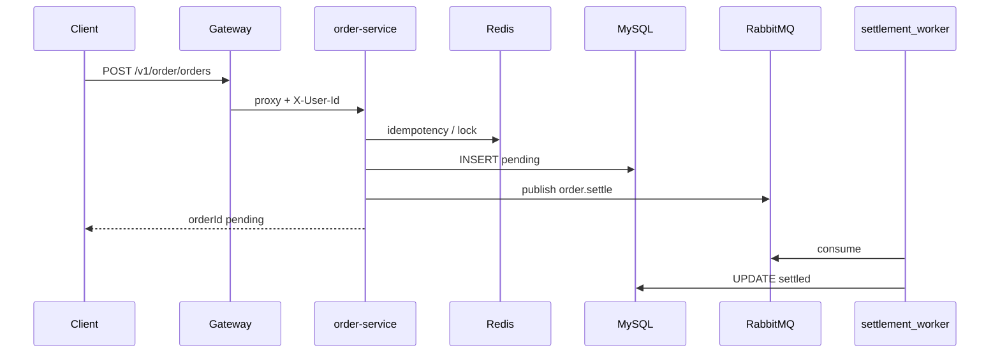

# 订单高并发 Demo（order-service）

本 Demo 演示「同步下单 + Redis 幂等/锁 + RabbitMQ 异步结算」最小链路，**非生产就绪**。

## 架构



## 前置条件

```bash
make compose-up
# 或本机：MySQL + Redis + RabbitMQ + make build && make dev
```

Compose 已包含 `rabbitmq`（管理界面 http://127.0.0.1:15672，默认 guest/guest）。

## 接口

| 方法 | 网关路径 | 说明 |
|------|----------|------|
| POST | `/v1/order/orders` | 创建订单，需 `Authorization` + `X-Idempotency-Key` |
| GET | `/v1/order/orders/{id}` | 查询订单状态 |

请求体：

```json
{"product_id":"sku-1","amount":99.00}
```

## curl 示例

```bash
# 1. 注册并登录（或使用已有账号）
BASE=http://127.0.0.1:8180
curl -s -X POST "$BASE/v1/auth/register" -H 'Content-Type: application/json' \
  -d '{"username":"demo","password":"demo123","mobile":"13900000001"}'

TOKEN=$(curl -s -X POST "$BASE/v1/auth/login" -H 'Content-Type: application/json' \
  -d '{"username":"demo","password":"demo123"}' | python3 -c "import sys,json; print(json.load(sys.stdin)['data']['accessToken'])")

# 2. 下单（固定幂等键则重复调用返回同一 orderId）
curl -s -X POST "$BASE/v1/order/orders" \
  -H "Authorization: Bearer $TOKEN" \
  -H "X-Idempotency-Key: demo-order-001" \
  -H 'Content-Type: application/json' \
  -d '{"product_id":"sku-1","amount":99.00}'

# 3. 查询订单（status 会从 pending 变为 settled）
curl -s "$BASE/v1/order/orders/1" -H "Authorization: Bearer $TOKEN"
```

## 自动化验证

```bash
make smoke          # 含 auth + order 流程
# 或单独
./scripts/smoke-order-flow.sh
```

## 平台封装（可复用）

| 包 | 路径 | 用途 |
|----|------|------|
| redislock | `internal/platform/redislock` | 分布式锁 SET NX |
| idempotency | `internal/platform/idempotency` | Redis 幂等快照 |
| mq | `internal/platform/mq` | RabbitMQ 发布/消费 |

## 已知局限

- 结算 worker 与 order-service **同进程**，未拆独立 settlement-service
- 无 Outbox、死信队列、Saga 补偿
- 无库存扣减、支付渠道、网关限流
- order-service 信任网关注入的 `X-User-Id`（仅适用于内网 Demo）

完整加服务步骤见 [add-service.md](add-service.md)。Redis 锁/幂等详细说明见 [redis-high-concurrency.md](redis-high-concurrency.md)。
