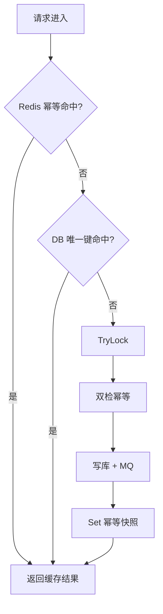

# Redis 高并发使用指南（Go 模版）

本文说明在本仓库中 **如何用 Redis 应对高并发**：分布式锁、幂等、会话、库存等。阅读对象：新增/维护 `order-service`、`member-service` 或其它业务服务的开发者。

---

## 1. Redisson 与本模版的关系

| 项目 | 说明 |
|------|------|
| **Redisson** | Java 生态的 Redis 客户端，封装分布式锁、信号量、限流器、Map、Queue 等 |
| **本仓库（Go）** | 使用 [`github.com/go-redis/redis/v8`](https://github.com/go-redis/redis) + `internal/platform/*` 轻量封装 |
| **结论** | **不能**直接 `import Redisson`；应使用模版已有封装，或在 `platform` 层扩展同类能力 |

### Redisson 能力 → Go 模版对照

| Redisson（Java） | 本模版等价 | 代码位置 |
|------------------|------------|----------|
| `RLock` / `tryLock` | `redislock.TryLock` + `Unlock` | [`internal/platform/redislock/lock.go`](../../internal/platform/redislock/lock.go) |
| 幂等 / 去重缓存 | `idempotency.Store` | [`internal/platform/idempotency/store.go`](../../internal/platform/idempotency/store.go) |
| `RBucket` + TTL | `redis.Set(key, val, ttl)` | member token、幂等快照 |
| `RMap` / 计数器 | `INCR` / `DECR` / `HINCRBY` | 见下文「库存扣减」示例（需自行封装） |
| `RRateLimiter` | 未内置 | 见下文「限流」示例（Lua + INCR） |
| 看门狗续期 | 未内置 | 当前锁靠 **TTL**；长任务需缩短临界区或后续扩展 |

> 若团队熟悉 Redisson API，可把本文当作 **概念迁移手册**：先找上表对应能力，再在 `app` 层组合使用。

---

## 2. 连接与配置

### 2.1 打开客户端

所有服务统一通过 [`store.OpenRedis`](../../internal/platform/store/store.go)：

```go
rdb, err := store.OpenRedis(cfg.RedisAddr, cfg.RedisPassword, cfg.RedisDB)
if err != nil {
    log.Fatalf("redis init failed: %v", err)
}
defer rdb.Close()
```

### 2.2 环境变量

| 变量 | 说明 | Compose 示例 |
|------|------|----------------|
| `REDIS_ADDR` | 地址 | `redis:6379` |
| `REDIS_PASSWORD` | 密码 | `redis1234` |
| `REDIS_DB` | DB 序号 | `0` |

本地见 [`configs/.env.example`](../../configs/.env.example)；Docker 见 [`configs/app.dev.json`](../../configs/app.dev.json)。

### 2.3 键命名规范（建议）

```
{业务}:{资源}:{标识}

token:{accessToken}              # 会话
idempotency:order:{userId}:{key} # 幂等（Store 内部带 scope）
lock:order:create:{userId}:{key} # 分布式锁
lock:inventory:{skuId}           # 库存锁
rate:login:{ip}                  # 限流计数
cache:product:{skuId}            # 热点缓存（按需）
```

- 使用 **小写 + 冒号分段**，便于 `KEYS` 排查（生产应用 SCAN，避免 `KEYS *`）。
- 锁、幂等、限流键 **必须设 TTL**，防止泄漏。

---

## 3. 平台封装详解

### 3.1 分布式锁 `redislock`

**原理**：`SET key token NX EX ttl` 获取锁；释放时用 **Lua** 校验 token 再 `DEL`，避免误删他人锁（与 Redisson `RLock` 同类思路）。

```go
import (
    "context"
    "errors"
    "time"

    "go-template/internal/platform/redislock"
    "github.com/go-redis/redis/v8"
)

func doWithLock(ctx context.Context, rdb *redis.Client) error {
    // 步骤 1：构造业务锁 key（粒度尽量细）。
    lockKey := "lock:inventory:sku-1001"

    // 步骤 2：非阻塞尝试加锁；TTL 应大于临界区耗时。
    lock, err := redislock.TryLock(ctx, rdb, lockKey, 10*time.Second)
    if err != nil {
        if errors.Is(err, redislock.ErrNotAcquired) {
            return errors.New("resource busy, retry later")
        }
        return err
    }
    defer func() { _ = lock.Unlock(ctx) }()

    // 步骤 3：在锁内执行短临界区（查库存 → 扣减 → 写库）。
    return deductInventory(ctx)
}
```

| 参数 | 建议 |
|------|------|
| TTL | 临界区 P99 的 **2～3 倍**；order Demo 用 `30s` |
| 失败策略 | 返回 `409` / 业务码 `40921`（见 order-service），或客户端退避重试 |
| 不可做 | 在锁内调外部 HTTP、长事务、无超时的 MQ 消费 |

**当前限制（Demo 级）**：

- 仅 `TryLock`（非阻塞），无 `Lock()` 自旋、无看门狗续期。
- 生产长任务可考虑：引入 [redsync](https://github.com/go-redsync/redsync) 或 Redisson 同款的 watchdog 逻辑，放在 `platform` 层统一维护。

---

### 3.2 幂等 `idempotency`

**场景**：同一 `X-Idempotency-Key` 重复 POST，返回 **相同业务结果**，不重复落库。

```go
import "go-template/internal/platform/idempotency"

store := idempotency.NewStore(rdb, 24*time.Hour)

scope := "order:" + userID
key := idempotencyKey // 来自 Header X-Idempotency-Key

// 读快路径
if rec, err := store.Get(ctx, scope, key); err == nil {
    return rec.OrderID, nil
}

// ... 执行业务 ...

_ = store.Set(ctx, scope, key, idempotency.Record{
    OrderID: orderID,
    Status:  "pending",
})
```

**三层防护（order-service 已实现）**：



对应代码：[`internal/order/app/service.go`](../../internal/order/app/service.go) 的 `CreateOrder`。

| 层级 | 作用 |
|------|------|
| Redis 幂等 | 毫秒级重复请求 |
| DB `UNIQUE(user_id, idempotency_key)` | Redis 失效时的最终一致 |
| 分布式锁 | 并发首请求仅一条写入 |

网关已透传 Header：`X-Idempotency-Key`（见 [`internal/gateway/transport/http/handler.go`](../../internal/gateway/transport/http/handler.go)）。

---

### 3.3 会话 Token（member-service）

**场景**：高并发登录/鉴权，token 存 Redis 而非每次打 DB。

键：`token:{token}` → `userID`，TTL 12h。

```go
// 写入（登录）
_ = tokenRepo.SetToken(ctx, accessToken, userID, 12*time.Hour)

// 读取（introspect / 网关鉴权）
userID, err := tokenRepo.GetUserIDByToken(ctx, token)
```

实现：[`internal/member/repo/redis_token_repo.go`](../../internal/member/repo/redis_token_repo.go)。

---

## 4. 订单服务完整示例（已落地）

### 4.1 调用链

1. 客户端经网关 `POST /v1/order/orders`，带 `Authorization` + `X-Idempotency-Key`
2. 网关注入 `X-User-Id`
3. `order-service` 走幂等 → 锁 → MySQL → RabbitMQ
4. 同进程 worker 异步 `settled`

详见 [order-demo.md](order-demo.md)。

### 4.2 curl 验证幂等

```bash
BASE=http://127.0.0.1:8180
TOKEN=$(curl -s -X POST "$BASE/v1/auth/login" \
  -H 'Content-Type: application/json' \
  -d '{"username":"u1","password":"p1"}' | python3 -c "import sys,json; print(json.load(sys.stdin)['data']['accessToken'])")

# 相同幂等键连发两次，orderId 应相同
for i in 1 2; do
  curl -s -X POST "$BASE/v1/order/orders" \
    -H "Authorization: Bearer $TOKEN" \
    -H "X-Idempotency-Key: demo-001" \
    -H 'Content-Type: application/json' \
    -d '{"product_id":"sku-1","amount":99}' | python3 -m json.tool
done
```

### 4.3 组装依赖（main.go 模式）

```go
rdb, _ := store.OpenRedis(cfg.RedisAddr, cfg.RedisPassword, cfg.RedisDB)
idemStore := idempotency.NewStore(rdb, 24*time.Hour)
svc := orderapp.NewService(orderRepo, idemStore, rdb, mqClient)
```

参考：[`cmd/order-service/main.go`](../../cmd/order-service/main.go)。

---

## 5. 其它业务场景示例

以下为新服务常见用法；**除 token/订单外尚未在仓库实现**，可按 [`add-service.md`](add-service.md) 在 `app` 层组合 `redislock` + `go-redis` 原语。

### 5.1 库存扣减（防超卖）

**问题**：并发下单同时读到 `stock=1`，可能卖出 2 件。

**方案 A：Redis 预扣 + Lua 原子 DECR（高并发首选）**

```go
// 键：stock:{skuId}  值为剩余库存
const decrStockLua = `
local n = tonumber(redis.call('GET', KEYS[1]) or '0')
if n <= 0 then return -1 end
redis.call('DECR', KEYS[1])
return n - 1
`
result, err := rdb.Eval(ctx, decrStockLua, []string{"stock:sku-1001"}).Int()
if err != nil || result < 0 {
    return domain.ErrOutOfStock
}
// 再异步或同步写 MySQL 订单；失败时需 INCR 回滚或走补偿
```

**方案 B：按 SKU 加分布式锁（实现简单，QPS 受锁粒度限制）**

```go
lock, err := redislock.TryLock(ctx, rdb, "lock:inventory:sku-1001", 5*time.Second)
// 锁内：SELECT stock FOR UPDATE 或 UPDATE ... WHERE stock >= 1
```

| 方案 | QPS | 复杂度 |
|------|-----|--------|
| Lua 原子扣减 | 高 | 中（需回滚策略） |
| 分布式锁 + DB | 中 | 低 |
| 仅 DB 乐观锁 | 低～中 | 低 |

---

### 5.2 登录 / 接口限流

**场景**：防刷接口、防暴力破解（类似 Redisson `RRateLimiter`）。

```go
// 固定窗口：rate:login:{ip}  INCR + EXPIRE
key := "rate:login:" + clientIP
n, err := rdb.Incr(ctx, key).Result()
if n == 1 {
    _ = rdb.Expire(ctx, key, time.Minute).Err()
}
if n > 20 {
    return errTooManyRequests // HTTP 429
}
```

可封装为 `internal/platform/ratelimit`（后续 v0.x 可选）。

---

### 5.3 优惠券「每人限领一次」

```go
scope := "coupon:claim:" + campaignID
key := userID

if _, err := idemStore.Get(ctx, scope, key); err == nil {
    return nil, domain.ErrAlreadyClaimed
}

lock, err := redislock.TryLock(ctx, rdb, "lock:coupon:"+campaignID+":"+userID, 10*time.Second)
// 双检 + 写 DB + idemStore.Set
```

与下单幂等模式相同，仅 `scope` 与 `Record` 结构不同；可将 `idempotency.Record` 泛化为 JSON `map` 或独立 `CouponClaimRecord`。

---

### 5.4 支付回调幂等

支付渠道可能 **重复通知**：

```
idempotency:payment:{channel}:{outTradeNo} -> { orderId, status }
```

- `outTradeNo` 作幂等键（渠道侧唯一）
- DB 侧 `UNIQUE(out_trade_no)`
- 锁键：`lock:payment:{outTradeNo}`

---

### 5.5 热点商品缓存

```go
cacheKey := "cache:product:" + skuID
if raw, err := rdb.Get(ctx, cacheKey).Result(); err == nil {
    return decodeProduct(raw)
}
product, err := repo.GetFromDB(ctx, skuID)
_ = rdb.Set(ctx, cacheKey, encode(product), 5*time.Minute).Err()
```

注意：**缓存与库存分离**；库存以 Redis 计数或 DB 为准，商品详情可缓存。

---

## 6. 与 MySQL / MQ 的配合

| 模式 | Redis 角色 | MySQL 角色 | MQ 角色 |
|------|--------------|------------|---------|
| 下单（当前 Demo） | 幂等 + 锁 | 订单持久化 | 异步结算 |
| 扣库存 | 原子计数 / 锁 | 最终库存账 | 可选同步 ES |
| 登录 | token | 用户主数据 | — |
| 支付回调 | 幂等 + 锁 | 支付单 | 通知订单域 |

原则：

1. **Redis 做协调与加速，MySQL 做账本**（订单、库存、支付以 DB 唯一约束兜底）。
2. **临界区尽量短**；重逻辑放 MQ 消费者（见 order worker）。
3. **始终传 `context.Context`**，避免 Redis 阻塞拖死 HTTP 请求。

---

## 7. 错误处理与 HTTP 映射

| 场景 | 领域错误 | 建议 HTTP / 业务码 |
|------|----------|-------------------|
| 锁未获取 | `domain.ErrLockNotAcquired` | 409 / `40921` |
| 幂等键缺失 | `ErrIdempotencyKeyRequired` | 400 / `40022` |
| token 无效 | `domain.ErrTokenInvalid` | 401 / `40102` |

order 相关码见 [`docs/api/error-codes.md`](../api/error-codes.md)。

客户端建议：

- 409：短暂退避后 **重试同一幂等键**
- 5xx：退避重试；仍用 **同一幂等键** 保证不重复下单

---

## 8. 本地调试

```bash
# Compose 一键（含 Redis）
make compose-up

# 本机 Redis
REDIS_ADDR=127.0.0.1:6379 REDIS_PASSWORD=redis1234 redis-cli -a redis1234

# 查看键
redis-cli -a redis1234 KEYS 'idempotency:*'
redis-cli -a redis1234 KEYS 'lock:*'
redis-cli -a redis1234 GET 'token:...'

# 冒烟（含幂等 + 结算）
make smoke
```

---

## 9. 生产演进清单（模版外）

按优先级可在 `internal/platform` 扩展：

1. **锁续期（Watchdog）**：长临界区自动延长 TTL
2. **redsync** 或 Redis 7 `SET key val NX EX` + fencing token
3. **滑动窗口限流** Lua 脚本
4. **Redis Cluster / Sentinel** 高可用（改 `OpenRedis` 为 ClusterClient）
5. **可观测**：锁等待时间、幂等命中率 metrics

---

## 10. 快速决策表

| 我要做… | 用什么 | 参考 |
|---------|--------|------|
| 防止重复提交订单 | `idempotency` + DB 唯一键 + `redislock` | order `CreateOrder` |
| 防止并发写同一资源 | `redislock.TryLock` | 本文 §3.1 |
| 登录态 / introspect | `RedisTokenRepo` | member-service |
| 防超卖 | Lua `DECR` 或 SKU 锁 | 本文 §5.1 |
| 防刷接口 | `INCR` + `EXPIRE` | 本文 §5.2 |
| 异步解耦重逻辑 | RabbitMQ | [order-demo.md](order-demo.md) |

---

## 相关文档

- [order-demo.md](order-demo.md) — 可运行订单 Demo
- [add-service.md](add-service.md) — 新增微服务 playbook
- [config.md](config.md) — Redis 环境变量
- [docs/conventions/code-comments.md](../conventions/code-comments.md) — 步骤级注释约定
